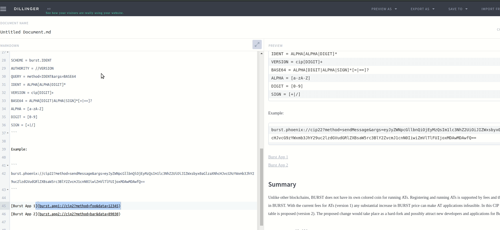

## Motivation
Currently, a few applications make use of so called _deep links_, which allow to open applications passing parameters and though redirecting to specific application screens. For example, Phoenix Wallet can be opened using such _deep link_ to request Signa. Nowadays, Signum-Node supports an _undocumented_ deep link feature by returning a QR code for only one method, which is `requestBurst`. It turns out, that  _deep links_ can easily establish interoperability between different Signum applications, as it is already done with HotWallet, Phoenix Desktop Wallet, but also Mobile Apps. Today, the content of such links has no consistent structure, such that links needs be well aligned between application developers. Using a well-defined and sufficiently generic structure for _deep linking_, can facilitate application interoperability. 

## Abstract

This proposal describes how to achieve consistent interoperability between applications within the Signum ecosystem. It recommends a lightweight specification for the concept called _deep linking_, and how it should be implemented.

## Specification

The proposed structure for the URI follows the official specification as described in [RFC3986](https://www.ietf.org/rfc/rfc3986.txt). The generic version of an URI looks like this

```
URI = SCHEME://[AUTHORITY]PATH[?QUERY][#FRAGMENT]
```

For this proposal the relevant components are

```
URI = SCHEME://PATH?QUERY
```

```
SCHEME = burst.DOMAIN
PATH = VERSION
QUERY = action=IDENT&payload=BASE64
DOMAIN = IDENT
IDENT = ALPHA[ALPHA|DIGIT]*
VERSION = v[DIGIT]+
BASE64 = ALPHA[DIGIT|ALPHA|SIGN]*[=|==]?
ALPHA = [a-zA-Z]
DIGIT = [0-9]
SIGN = [+|/]
```

#### Example

```
burst.message://v1?action=send&payload=eyJyZWNpcGllbnQiOjEyMzQsIm1lc3NhZ2UiOiJIZWxsbyx0aGlzaXNhcHJvcG9zYWxmb3JhY29uc2lzdGVudGRlZXBsaW5rc3BlY2ZvcmJ1cnN0IiwiZmVlTlFUIjoxMDAwMDAwfQ==
```


### Scheme 
A _scheme_ determines the domain within the burst ecosystem. Technically, the _scheme_, also known as _protocol_, links the operation systems default startup for a certain application.
It consists of the static prefix `signum.` followed by an alphanumeric string that defines the targeted domain.

### Domain
A _domain_ describes the "area" where a linked application belongs to. This implies that per platform only one application can be linked to a domain, as disambigation might lead to undefined behavior. It is possible to map one application to many domains, if that application is _omnipotent_. Domain names are required and must be a non-empty alphanumeric URI compatible value. 

### Path

The _path_ is almost only a prefix to determine the version of the specification. The proposed value is `v[/d]*`, as this allows to enhance/extend/improve this specification in the future. On activation of this CIP, it would be `v1`.

### Query

The _query_ segment is part of the RFC3986 normative. In the context of this proposal, the query carries information about the callers intention, i.e. action and its payload to be executed within the linked application. The _query_ consists of two components:

- __action__ The alphanumeric name (in plain text) of the action that should be called within the application
- __payload__ Any arbitrary data decoded in base64, that is used by the action.

The caller should use actions which are supported by the linked application. If an application does not know of that action, the application must be sufficiently robust, to handle that case, e.g. ignore the action and open on default screen, and/or show a message informing about the non-supported action. The payload _must_ be sanitized by the application to guarantee proper functioning and avoid injection attacks. 

## Signum-Node API Change

Signum-Node API supports a method called `generateSendTransactionQRCode`, which creates a QR-Code for a deep link with scheme `burst://`. It returns very specific data, and lacks versatility. In addition to this endpoint a more generic endpoint for QR Code generation should be provided:

`generateDeepLinkQRCode(string domain, string action, string payload)` 

Additionally, another method to mount the only the link would be useful:
 
`generateDeepLink(string domain, string action, string payload)` 

## Summary

This specification of _deep linking_ within the Signum eco-system simplifies the interoperability between Signum applications. It permits that the feature-rich platform can be splitted in different specialized applications, i.e. asset exchange, simple wallet, messaging application, while maintaining an integrated user-experience. It is even possible to create "meta-applications", which serves as a container for those applications. 




## Compatibility

The change can be applied to Signum-Node without any impact on the network. It's merely an extension of the API. The existing QRCode Generator class will be adjusted, but for backwards compatibility the one and only method _requestSigna_ should be kept. It's recommended to mark as deprecated. Furthermore, anendpoint for generating only the URI will be created, too.

## Additional notes

Upon activation, the current deep link implementation in Signum-Node will be adjusted to follow the suggested specification. The current API will be extended by a new endpoint.

## References

- [Undocumented BRS deep link](https://github.com/signum-network/signum-node/blob/develop/src/brs/deeplink/DeeplinkQRCodeGenerator.java)
- [RFC3986](https://www.ietf.org/rfc/rfc3986.txt)
- [Deep Linking](https://en.wikipedia.org/wiki/Deep_linking)
- [Nobile Deep Linking](https://en.wikipedia.org/wiki/Mobile_deep_linking)


## Copyright
Copyright and related rights waived via [CC0](https://creativecommons.org/publicdomain/zero/1.0/).
