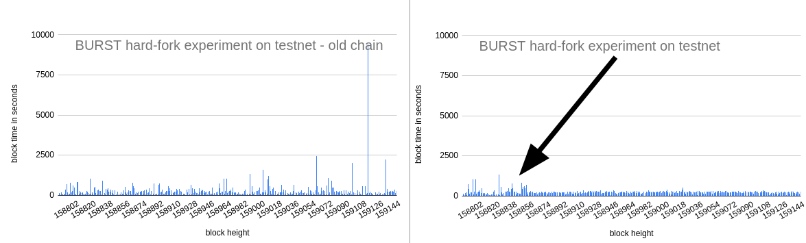

## Motivation
The current implementation in Signum, the pioneer of Proof of Capacity, results in very good block time averages, with daily deviations smaller than 5% around the target value of 4 minutes (240 seconds). The individual block times, on the other hand, show a broad deviation with block times typically ranging from 10 seconds to 2’000 seconds (30 minutes). In this SIP a novel method to reduce individual block times variation is proposed.

## Abstract
The block time variation issue is investigated on the following article [An Analysis of Proof of Capacity Block Times](https://link.medium.com/LcwXJx8Yn3). By theoretical and empyrical observation it is shown that block times should respect an exponential distribution due to the inherent stochastic nature of the mining process. On that article it is also shown theorectically that a logarithm transformation could much reduce the problems observed.

## Specification

Compute deadlines as follows:

`deadline = ln(hit/baseTarget) * 240/ln(240)`

Instead of the current formula:

`deadline = hit/baseTarget`

The change on the deadline makes the block signatures invalid with the old formula. So there is an immediate split between clients with and without the new protocol.

Special care must be taken if the logarithm function argument is zero or a value too large.
The reference implementation on the [PR393](https://github.com/signum-network/signum-node/pull/393) is already prepared to handle these cases.

### Effects of the new deadline formula
Besides theorectical soundness for the modified formula an experiment was executed on testnet. Even with a small fraction of mining power a fork took place and two incompatible branches resulted. After nearly a day of mining the result was the following:

As can be seen, the modified version shown a much improved consistency on block times. Further, the daily average block times were 241 s and 267 s for the new and old fork, respectively. When using the modified version, the typical occasional very long block times are avoided (even with such a small capacity used on the tests) as well as the usual very short blocks.

### Effects on Mining and Mining Sofware
The implementation proposed on[PR393](https://github.com/signum-network/signum-node/pull/393) requires no change on mining software. The deadline confirmation returns the *legacy* value to miners so they can be unaware of the upgrade.

Further, it is clear to see that the *best* deadline is the *best* deadline regardless of the modification (logarithm is a monotonical function). No changes are need on mining software as long as they send their best deadline to the mining node.

## References

* [An Analysis of Proof of Capacity Block Times](https://link.medium.com/LcwXJx8Yn3)
* [PR393](https://github.com/signum-network/signum-node/pull/393)

## Backwards Compatibility
This is a hard forking change, thus breaks compatibility with old fully-validating node. It should not be deployed without widespread consensus.

## Copyright
Copyright and related rights waived via [CC0](https://creativecommons.org/publicdomain/zero/1.0/).
