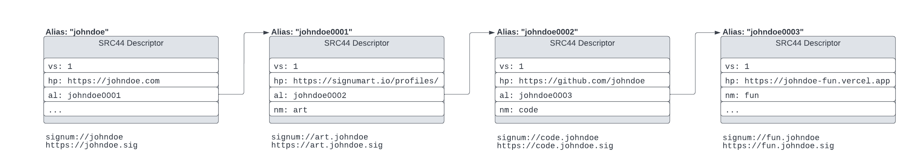

## Abstract

The Signum Alias feature can be used to resolve URIs into URLs. In browsers, it is possible to use an extension, e.g. XT Wallet,
to resolve URIs in the browsers navigation bar to any arbitrary URLs. This SIP proposes a simple standard for such URI resolvers, and even supports subdomains. 

## Motivation

If a user enters a customized URI, e.g. `signum://johndoe`, `https://$johndoe` or `https://johndoe.signum` in the browsers URL bar, it is possible to resolve this customized URI into an internet URL.

Aliases in Signum are mutable on-chain data owned by users. Using the [standard descriptor](sip-44.md), it is possible to reference to any internet resource.
To make browsers understand the custom URI, an installable extension is required, such that a URI can be read, resolved and updated according to the resolved URL. The XT Wallet will support this feature, 
once this proposal is accepted.

## Specification

In the following, a structured URI Scheme is proposed, that works in conjunction with the [SIP44](sip-44.md) description standard and the Alias System, and can be resolved to 
any other URL, in special to other internet resources.

The proposed structure for the URI follows the official specification as described in [RFC3986](https://www.ietf.org/rfc/rfc3986.txt). The generic version of an URI looks like this

```
URI = SCHEME://[AUTHORITY]PATH[?QUERY][#FRAGMENT]
```

For this proposal the relevant components are

```
URI = SCHEME://PATH
```

```
SCHEME = [signum|http|https]
PATH = [$]?[ALIAS.]?ALIAS[.TLD]?[/PATH]?
TLD = [signum|signa|sig|sns|free|web3|crypto|p2p|wallet|blockhain|dex|decentral|dao|nft|coin|sustainble|w3|x|y|z]
PATH = ALPHA[ALPHA|DIGIT]
ALIAS = ALPHA[ALPHA|DIGIT]{1,100}
ALPHA = [a-zA-Z]
DIGIT = [0-9]
```

The `TLD` is only needed, if the `SCHEME` is not `signum`, or no shortform prefix `$` is being applied.
When using `ALIAS.ALIAS`, the first `ALIAS` is considered as [subdomain](#subdomains).

> The TLDs may change over time, depending on ICANNS registration of new/colliding TLDs 

The `PATH` segment can be used for [deep resolution](#deep-resolution).
 
_Examples:_

Without subdomain:

`signum://johndoe` or semantically identical `https://johndoe.signum`, `http://johndoe.sig`, `https://$johndoe`

With subdomain:

`signum://projects.johndoe` or semantically identical `https://projects.johndoe.signa`, `http://projects.johndoe.sns`, `http://$projects.johndoe`


### URL Resolution

The Alias System of Signum can be used to store the target URL. For resolvers, it is necessary to encounter structured data inside aliases, such that the referenced URL can be read consistently.
Thanks to [SRC44](sip-44.md) this is possible, and the required field for resolving a URL MUST BE `hp`. The alias name in the URI can either serve as domain, or subdomain. 
The resolver MUST always start looking for the alias name according to the domain, and then resolves the subdomain.

_Example:_

The URI `signum://johndoe` only provides a single domain. The resolver reads the descriptor of the alias `johndoe` and resolves
to the URL provided in `hp`, which is here `https://github.com/johndoe` 

```json
{
  "vs": 1,
  "hp": "https://github.com/johndoe"
}
```

### Subdomains

The URI schema allows support of subdomains. As mentioned before, the URL resolver must resolve the domain alias first, and then
the subdomain alias. Therefore, aliases can reference forward to other aliases using the `al` field. The URL resolver MUST detect circular dependencies and stop
further resolution.

_Example:_

The URI `signum://myprojects.johndoe` provides the domain `johndoe` and the subdomain `myprojects`. The resolver reads the descriptor of the alias `johndoe` and resolves
to the URL provided in `hp`, which is here `https://github.com/johndoe`

The SRC44 compliant alias descriptor for `johndoe` may look like this:
```json
{
  "vs": 1,
  "hp": "https://johndoe.com",
  "al": "johndoe0myprojects" 
}
```

> The alias _johndoe0myprojects_ can be any kind of valid alias, i.e. `jd0000001`, or `0xDEADBEEF`. It's just a reference to another on-chain data. 

As the domain alias is forwarding to `johndoe0myprojects`, the resolver MUST look up the referenced alias and check if the `nm` (name) field matches the queried subdomain

The SRC44 compliant alias descriptor for `myprojects` subdomain (using the Alias `johndoe0myprojects`) may look like this:

```json
{
  "vs": 1,
  "nm": "myprojects",
  "hp": "https://github.com/johndoe"
}
```

#### Multiple Subdomains

As an account can have multiple subdomains (no fixed limit set), the resolver MUST resolve each referenced alias until it finds an alias with a matching `nm` field.

The search MUST stop if 

1. `nm` field matches requested subdomain
2. no further `al` field is available
3. the `al` field does not resolve to an existing alias
4. a circular reference occurs

> Keep in mind that resolving to subdomains takes more time the more subdomains are linked to the alias reference list. Resolving subdomains can cause _O(n)_ requests.



### Different Schemas and TLDs

For simplicity - while typing the URI inside the browsers URL bar - the `http` and `https` schemas are acceptable, but this requires the user
to type one of the supported (at this time of writing) non-existing top level domains (TLD) or using the shortform prefix `$`
The following URIs resolve always to the same URL:

- `signum://arts.johndoe`
- `https://$arts.johndoe`
- `http://$arts.johndoe`
- `http://arts.johndoe.dex`
- `http://arts.johndoe.signa`
- `http://arts.johndoe.x`
- `http://arts.johndoe.y`
- `http://arts.johndoe.z`
- `https://arts.johndoe.crypto`
- `https://arts.johndoe.decentral`
- `https://arts.johndoe.free`
- `https://arts.johndoe.sig`
- `https://arts.johndoe.signum`
- `https://arts.johndoe.web3`

At this moment following TLDs are supported 

> More TLDs can be added, as long as they are not registered by ICANN

- blockhain
- coin
- crypto
- dao
- decentral
- dex
- free
- nft
- p2p
- sig
- signa
- signum
- sns
- w3
- wallet
- web3
- x
- y
- z

### Deep Resolution

Per default a URI resolves to the alias' `hp` field, but it is possible to select a specific field inside the SRC44 compliant 
structure as long as it is available. This way it is possible, to use the URI and resolve to an Account Id (using the `ac` field), or even custom fields.

_Example:_

The URI `http://johndoe.x/ac` would return the account Id for `johndoe`, if it exists, while `http://johndoe.x/tp` returns the type and so forth. 

This counts also for custom fields, so it is possible to do `http://johndoe.x/x-myfield`.  

## Compatibility

This proposal does not require compatibility considerations.

## Copyright

Copyright and related rights waived via [CC0](https://creativecommons.org/publicdomain/zero/1.0/).
